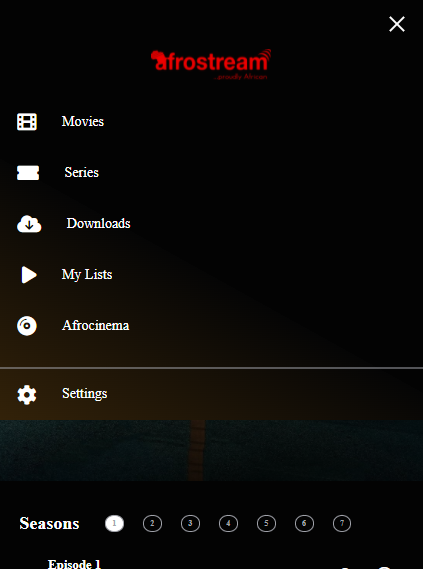
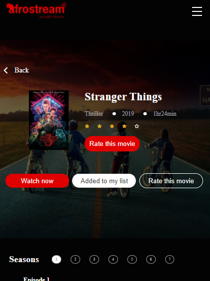
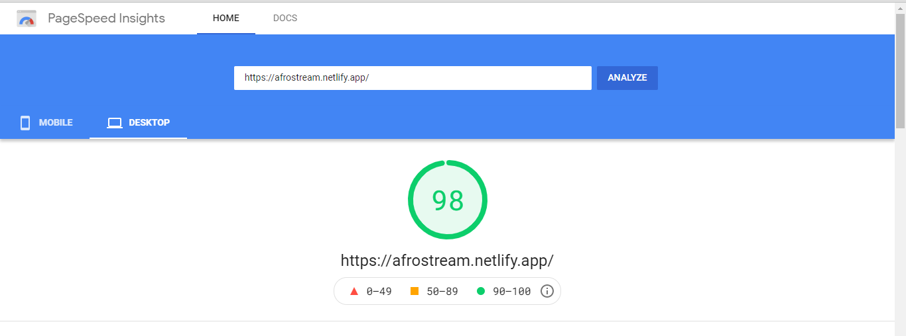

<a href="https://afrostream.netlify.app/">
    
</a>

## AfroStream Design

<br>

[](https://github.com/prettier/prettier)
[](https://github.com/calvin-puram/acomart/blob/master/LICENSE)
[](https://vuejs.org/v3/guide/)
[](https://app.netlify.com/sites/afrostream/deploys)

[AfroStream](https://afrostream.netlify.app/) web app design

[](https://afrostream.netlify.app/)
[](https://afrostream.netlify.app/)
[](https://afrostream.netlify.app/)

## page speed preview

[](https://afrostream.netlify.app/)

## AfroSream App built by:

- Name: Calvin Job Puram
- Email: puram.calvin@gmail.com

## Project Breakdown

- AfroStream built using [vue3](https://vuejs.org)
- [x] all images are optimized to reduce file size using - [tinypng](https://tinypng.com/);
- [x] css architecture using - [sass](https://sass-lang.com/);
- [x] css naming convention using - [BEM](http://getbem.com/);

## Prerequisites

### Install NodeJS [](https://nodejs.org/en/)

Refer https://nodejs.org/en/ to install NodeJS

### Install Vue Cli [](https://cli.vuejs.org/guide/)

Install Vue Cli Node Package Globally using the following Command.

```bash
npm install -g @vue/cli
```

## Cloning and Running the Application

Clone the application to local

Go into the project Folder and install the npm packages using the following command

```bash
npm install
```

Run the following command to run the application

```
npm run serve
```

The Application runs on **localhost:8080**
